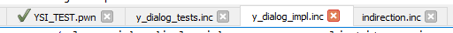
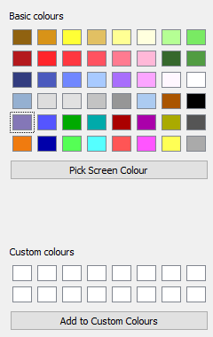

 Qawno
=======

Qawno is a simple cross-platform Pawn editor with syntax highlighting, script compilation, and open.mp server launch support.


 Features
----------

* **Syntax Highlighting** - Simplify reading code by visually distinguishing different types of text, comments, strings, keywords, etc.
* **Auto Completion** - Speeds up code by trying to guess what function you are trying to write, and suggesting complete symbols to insert in to code.
* **Natives List** - Show known natives (and some other functions) in a side bar for fast reference.  Clicking on these will show their parameters and return types as well.
* **Tabs** - Open multiple files at once while working on large scripts.
* **Pawn Compiler** - Compile your code and view the output directly in a panel at the bottom of the program.
* **open.mp Launch** - Start a server running your code immediately for fast feedback.
* **Colour Picker** - Select hex numbers representing colours visually (`Ctrl+M`).
* **Editing Helpers** - Scroll with `Ctrl+Up`/`Ctrl+Down`.  Duplicate lines and sections with `Ctrl+D`/`Ctrl+Shift+D`.  Delete a line with `Ctrl+L`.  Comment a line with `Ctrl+K`.  Also block comment a selection with `Ctrl+K`.
* **Find And Replace** - Search for some text, and optionally replace the found location with new text.  Alternatively replace all the instances of that text with the new version.

 Main View
-----------


### 1. The Title Bar.

Tells you the name of the file currently being edited, and the name of the program (*Qawno*).  If the current file has been changed and not saved this will include a `*` after the filename:


### 2. The Menu Bar.

Provides visual access to all the editor features and options.


* *New Gamemode* - Start a new file in a new tab (shown in area ***3***).  This is the default *new* action (`Ctrl+N`) and creates (*scaffolds*) a basic file for writing a gamemode (also known as a *main script*).
* *New Filterscript* - Start a new file in a new tab.  Scaffolds a filterscript (*side script*), which are feature script that run along-side the main script.
* *New Include* - Start a new file in a new tab.  Scaffolds an include, a file that provides functions and features that can be used inside other scripts.  `Ctrl+I` as it is actually the new file type that should be created the most, to fully divide a mode in to multiple files.
* *New Blank* - Start a new blank file in a new tab.
* *Open* - Open an existing file in a new tab (or the initial tab if the program was just started).
* *Close* - Close the current file in the current tab.  Will prompt you to save it if the code has been changed.
* *Save* - Save the current file in the current tab.  Will do *Save As* for new files.
* *Save As* - Save the current file in the current tab with a specified name and location.
* *Save All* - Save all the files open in all the tabs.  New files will prompt for a name and location.
* *Quit* - Close Qawno.  Will remember all the currently open tabs for next time.


* *Undo* - Revert the last change made, such as typing, pasting, or replacing.
* *Redo* - If you undid an action, perform the action again.
* *Cut* - Put the currently selected code on to the clipboard and delete it from the editing text.
* *Copy* - Put the currently selected code on to the clipboard.
* *Paste* - Insert the latest item from the clipboard (if it is text) in to the current position in code.  If code is selected this will replace the selection.
* *Find...* - Search for some text in the current document.  May optionally replace the found text with new text.
* *Find Next...* - If an item of text has been found this attempts to move on to the next instance of that text in the current file.
* *Go To Line...* - Enter a line number and the cursor will move straight to that line (see area ***8***).  Useful for jumping to compiler error locations.
* *Duplicate Selection* - Will make a copy of the current selection, or the current line if there is no selection.
* *Duplicate Line* - Will make a copy of the whole line or lines that the cursor is currently on below the current line.
* *Delete Line* - Will remove the whole line that the cursor is currently on.
* *Comment Line/Selection* - If the cursor is on a normal line with nothing selected, this will comment out the current line by adding `//` to the start.  If a block of text is selected this will instead comment out that block using `/* */`.  Pressing this option again on the same line or block will reverse the action, so performing it on a line or block already commented out will uncomment the line or block.
* *Colour Selection* - Opens the colour selection dialog (colour picker).  This makes inserting hex colour codes simpler by allowing you to choose them visually, and by pre-defining and saving useful or common ones.  See below for full documentation on this feature.


* *Compile* - Use the pawn compiler to convert the current file in to a .AMX.  Will save *all* open files first as the main script may depend on other files being edited at the same time.
* *Compile + Run* - Compile the code as with *Compile*, and then attempt to run the open.mp server and lauch the current mode.  If a server is already open this will first kill that instance so that clients/players connected will automatically re-connect.
* *Run* - Relaunch the server with the current script.
* *Mark Entry* - Mark the current tab as the one always compiled.
* *Next Error* - Jump straight to the location in code of the next error *or warning* from the output.


* *Font -> Editor* - Change the font styles and sizes used in the main code editor pane (area ***4***).
* *Font -> Output* - Change the font styles and sizes used in the compiler output pane (area ***5***).
* *Dark Mode* - Make the main background for the editor, compiler, and native selector (areas ***4***, ***5***, and ***7***) black, and the code and other writing bright colours on top of this dark background.  Or reverse the effect.
* *MRU Tab Switching* - You can change which tab (and thus file) is currently visible using *Ctrl+Tab* to cycle through the tabs from left to right, or `Ctrl+Shift+Tab` to go from right to left.  This option changes that behaviour so that *Ctrl+Tab* instead jumps straight to the tab used previously, making the current tab the previous tab in the process.  Keeping *Ctrl* held down will continue to cycle through in the *Most Recently Used* (*MRU*) order, with *Ctrl+Shift+Tab* still going backwards through this new order.
* *Compiler* - Set the location and launch parameters for the compiler when using *Build -> Compile*.
* *Server* - Set the location and launch parameters for the server when using *Build -> Run*.


* *About* - Display information about who wrote this Pawn editor.
* *About Qt* - Display information about the Qt library, used to create this Pawn editor.

### 3. The Tab Bar

This shows you all the files you currently have open.  Clicking on any of the tabs will bring that file to the fore so you can edit it.  If there are a lot of tabs open (or tabs with long paths) the tab bar will have small arrows for scrolling the list.  The shortcuts `Ctrl+1` - `Ctrl+0` will take you straight to the numbered tab (starting at `1` on the left).

### 4. The Editor

This is where you type code to be run later.

### 5. Compiler Output

This is where the compiler displays its messages after being invoked with *Run -> Compile*.  Double-clicking on a warning or error in the output pane will jump straight to the source of the issue:


After compiling `Build -> Next Error` or `Ctrl+E` will automatically move through the warnings and errors, and their locations in code.  Pressing `Ctrl+E` once will *select and copy* the entire error message making asking for help easy [without the ridiculous trend of posting text as an image](https://textnot.pictures/):


Pressing `Ctrl+E` a second time will jump to the location of the first warning or error in code, a third time will jump to the second warning or error, and so-on, eventually looping back to the start:


The easy way to remember `Ctrl+E` is *Control Error*, but don't forget that it also does warnings, and that warnings are not the same as errors.  `Ctrl+W` can't be used for this as it is *Close Tab*.

### 6. The Status Bar

By default this shows the current line and column of the cursor:


If some text is selected it will also display how much text is selected:


If a native is selected from the native list (area ***7***) the status bar will display the full prototype (design) for the selected native:


### 7. The `native`s List

When Qawno starts it looks for all `.inc` files in `qawno/include` (but not subdirectories) and opens them to look for `native` functions.  The results of this search are shown in this area, and are also added to auto complete's list of suggestions.  This allows for very rapid access to known server/component/plugin function while writing code - both through predictions and through the list in this area.  Clicking on a native will display the full prototype for the function in the status bar (see ***6. The Status Bar***), the prototype being the return tag, the name, and all the parameters.  While this only lists `native` functions there are built-in tricks to manipulate the list.

Given the following include (`example.inc`):

```pawn
native Example1Impl(value);

stock Example1(value)
{
	return value > 0 ? Example1Impl(value) : 0;
}

native Example2(value);
```

The list for this file looks like:


We would like to:

1. *Not* show the native `Example1Impl` in the list - it is an internal function that should be hidden from users.
2. *Show* `Example1` in the list, despite it not being a native.

The solution to both of these aims are block comments.  The native list doesn't fully parse the file, it just looks for lines that start with `native` (ignoring leading spaces), so we can use this fact to write code that is different for the editor and the compiler:

```pawn
/**/ native Example1Impl(value);

/*
native Example1(value);
*/
stock Example1(value)
{
	return value > 0 ? Example1Impl(value) : 0;
}

native Example2(value);
```

`Example2` hasn't changed, it is still displayed the same.  `Example1Impl` is now no longer on a line that starts with `native` so it isn't displayed.  The compiler still sees it because the `/**/` is skipped, but Qawno doesn't.  And we've added a new `native` declaration for `Example1` that Qawno does see (because the line starts with `native`) but the compiler doesn't (because it is within a `/**/` block comment).  This list becomes:


We have one final requirement:

3. *Organise* the natives in our list aesthetically.

There are only two, but for larger includes this allows for neat grouping of natives.  Bear in mind that the list order in Qawno is always exactly the order from the `.inc` file so this trick can work.  Just like in markdown we can add *native headers* - natives that start with `#`.  These are not valid pawn syntax so must also be commented out, but will be interpreted by Qawno in a special way (and will not be suggested by auto-completion):

```pawn
/**/ native Example1Impl(value);

/*
native #The 1st example();
*/

/*
native Example1(value);
*/
stock Example1(value)
{
	return value > 0 ? Example1Impl(value) : 0;
}

/*
native #The 2nd example();
*/

native Example2(value);
```

In Qawno gives:


A real-world include showing some of these tricks can be seen in [the sscanf plugin](https://github.com/Y-Less/sscanf/blob/master/sscanf2.inc).  The heading were inspired by an earlier trick used by YSI for organising natives in Pawno, but without `#` so they could still be used.

### 8. Line Numbers

This shows the numbers for each line, i.e. how far down in the file they are.  Compiler warnings and errors use these line numbers to direct you to the problems, and you can jump straight to them by value with `Go To Line...`.

 Compile And Run
-----------------

### Invoking The Compiler

`Build -> Compile` in the menu, or `F5` will compile the **current** file by default.  However, it is often the case (or should be) that multiple open files are part of the same mode, and thus the compiler should always build from the same entry point.  Going to one tab, editing some code, then returning to the main script to compile can get annoying (even with *MRU*), so there is an extra option in the build menu - *Mark Entry*.  When enabled this will denote the current tab as the main tab (the *entry point*) and the *compile* and *run* commands will use that tab instead of the current tab.  The marked tab is shown with a tick:



You can see the command used to perform the compile, along with the eventual output, in the compiler output area ***5***.  A common command will look something like:

```
pawncc -;+ -(+ -\ -Z- "-rD:/open.mp/gamemodes/YSI_TEST" "-iinclude" -d0 -O2 -t4 "-iD:/open.mp/gamemodes/YSI_TEST" "-oD:/open.mp/gamemodes/YSI_TEST" "D:/open.mp/gamemodes/YSI_TEST.pwn"
```

* `pawncc` - The name of the compiler.
* `"D:/open.mp/gamemodes/YSI_TEST.pwn"` - The name of the file being compiled (i.e. the file open in the current tab).
* `-;+ -(+ -\ -Z- -d0 -O2 -t4` - Various flags for settings common to open.mp.  In order: require semi-colons, require brackets, backslash escape character, disable legacy mode, no debug symbols, maximum optimisation level, tab size 4.
* `-iinclude` - `-i` means *include directory*, so this adds the `include` directory next to Qawno as a location for importing other files.
* `"-iD:/open.mp/gamemodes/YSI_TEST"` - Same as above, `-i` means *include directory*, so this attempts to use a folder with the same name as the file being built as a search location for dependencies added with `#include <filename>`.
* `"-oD:/open.mp/gamemodes/YSI_TEST"` - `-o` is *output* so this is the **base** filename of the output.  An extension is added based on the type of compilation - `.amx` (default), `.asm` (with `-a`), or `.lst` (with `-l`).
* `"-rD:/open.mp/gamemodes/YSI_TEST"` - `-r` is *report* thus this generates a *report* file, i.e. a `.xml` file with all the documentation on functions used in the code.

See the compiler settings for more command-line configuration options.

### Running The Server

`Build -> Compile + Run` in the menu, or `F6` will compile the current file as above, then also start an open.mp server instance with the successfully compiled code (assuming it was successfully compiled).  Every time you use `F6` any existing server will be force-closed and a new one started as a trick to force the client to reconnect.  If you don't want to recompile as well use `F7` instead:


See the server settings for more command-line configuration options.

 Editing Tools
---------------

### Delete Lines (Ctrl+L)

`Ctrl+L` will delete the current line(s):

Before:


After:


Before:


After:


### Duplicating Sections (Ctrl+D)

`Ctrl+D` will duplicate the current line if there is no selection:

Before:


After:


If an area is selected it will duplicate just that section:

Before:


After:


Even if that section spans multiple lines:

Before:


After:


### Commenting (Ctrl+K)

When on a line pressing `Ctrl+K` will automatically comment out that line:

Before:


After:


Unless that line is already commented out, in which case it will uncomment it:

Before:


After:


The same will happen with multiple commented lines - they will all be uncommented together:

Before:


After:


But if even one line is uncommented, *all* the lines will be commented out, even those that are already commented out.  They will get an additional comment at the start, which allows for round-tripping.  I.e. you can select a large block of code, which might already include comments; comment it out for testing; then uncomment it again to return to exactly what you started with.  If the already commented lines didn't add an extra comment start, they would become uncommented at the end and break code:

Before:


After:


Round-Tripped:


### Auto-Complete

Typing at least three symbol characters (`a-z`, `A-Z`, `0-9`, `_`, and `@`) will bring up the auto-completion list, with all known symbols containing those characters in that order.  For example typing `ABC` will suggest `CreateObject` (`creAteoBjeCt`), `Get3DTextLabelColor` (`get3dtextlABelColor`), and many more.  The more characters you type, the more refined the results will be.  The results are also ordered by likelihood, so the best matches, and the functions used the most come first:


Pressing `Enter` (`Return`) will instantly insert the top suggestion:


You can also use the arrow keys to move to a different function before selecting and inserting it.  Doing so will increase the future priority of the chosen function:


The predictions are collected from all open files and the natives list on the right-hand side.  This gives a close approximation to being able to offer suggestions from all of a project.  When a file is opened it is parsed and all names longer than three characters are extracted and stored.  The same is also done while typing.

### Move Lines Up (Ctrl+Shift+Up)

This key combination will move the currently selected lines up one place.

### Move Lines Down (Ctrl+Shift+Down)

This key combination will move the currently selected lines down one place.

 Opening Files
---------------

You can open multiple files at once by selecting them:


Dragging them on to Qawno:


And dropping them there:


You can alternatively open multiple files at once using `File -> Open` and selecting multiple files:


 Colour Picker
---------------

Going to *Edit -> Colour Selection* or pressing *Ctrl+M* will bring up the colour selection dialog, shown below:


### Left Pane

The left half of the dialog is pre-defined colours.  `Pick Screen Colours` brings up a crosshair with which you can click anywhere on your screen to extract the colour at that point.  `Add to Custom Colours` saves the currently selected colour from the right half of the dialog to the currently selected `Custom colours` slot (make sure you select the slot first to avoid overwriting existing ones).  These saved custom colours will survive Qawno being restarted so you can use them throughout your project.  This half also includes the pre-defined `Basic colours`, detailed later:



### Right Pane

The right half of the screen is the main colour selection area.  The two top boxes can be clicked and dragged to to adjust the current colour.  The `Hue`, `Sat` (*saturation*), and *Val* (*value*) (collectively `HSV`); or `Red`, `Green`, and `Blue` (collectively `RGB`); boxes can be used to make fine adjustments to the individual colour componenets.  The `Alpha channel` input is used by both *HSV* and *RGB* and determines the transparency of the colour.  `0` is invisible (totally transparent), `255` is fully opaque, the default is `170` (`0xAA` in hex).  The `HTML` input can be used to preview an existing colour already in *RGB* hex format, and must include the `#`.  The final panel is a larger preview of the currently selected colour, ignoring transparency:


### Insertion

Clicking on `OK` will insert your chosen colour in to your code at the current cursor position.  If the letter immediately before the cursor is an `x` the colour will be inserted as *RGBA*:

```pawn
#define MY_COLOUR 0x// Press Ctrl+M here.

#define MY_COLOUR 0xFF0000AA // After selecting a colour.
```

Anywhere else will give the colour in *RGB* format:

```pawn
#define MY_COLOUR "{}" // Press Ctrl+M in the braces.

#define MY_COLOUR "{FF0000}" // After selecting a colour.
```

Clicking `Cancel` will not insert anything.

### Pre-Defined Colours

The pre-defined `Basic colours` are forty eight common colours from San Andreas, SA:MP, and open.mp, in three groups.  Note that the dialog itself is limited to 48, hence these specific choices and why obvious options like player and vehicle colours were ommitted:


These are the selectable game text colours.  From left to right:

First row:

* `(default)` (`#906210`) (game texts default colour, and the currently playing radio station).
* `~h~` (`#D89318`) (default colour, but slightly lighter).
* `~h~~h~` (`#FFFF36`) (default colour, even lighter still).
* `~y~` (`#E2C063`)
* `~y~~h~` (`#FFFF94`)
* `~y~~h~~h~` (`#FFFFDE`) (the same as `~g~~h~~h~~h~~h~`).
* `~g~~h~~h~~h~` (`#B5FF94`)
* `~g~~h~~h~` (`#79EA63`)

Second row:

* `~r~` (`#B4191D`) (also the color of negative money).
* `~r~~h~` (`#FF252B`)
* `~r~~h~~h~` (`#FF3740`)
* `~r~~h~~h~~h~` (`#FF5260`)
* `~r~~h~~h~~h~~h~` (`#FF7B90`)
* `~r~~h~~h~~h~~h~~h~` (`#FFB8D8`) (the lightest any colour can go without becoming white).
* `~g~~h~` (`#519C42`)
* `~g~` (`#36682C`) (also the colour of positive money and entered vehicles).

Third row:

* `~b~` {`#323C7F`}
* `~b~~h~` {`#4B5ABE`}
* `~b~~h~~h~` {`#7087FF`}
* `~b~~h~~h~~h~` {`#A8CAFF`}
* `~p~` {`#A86EFC`}
* `~p~~h~` {`#FCA5FF`}
* `~p~~h~~h~` {`#FFF7FF`}
*  {`#FFFFFF`} (any other colour with an extra `~h~`).

Fourth row:

* `~l~`  {`#000000`}


These are the 17 CGA colours, just a simple set of common primary and secondary colours.  The white and black are the same as the game text colours, and the brown on top is the later "tweaked brown".

First row:

* White (`#FFFFFF`)

Second row:

* Tweaked brown (`#AA5500`) (from a later CGA revision).
* Black (`#000000`) (same as `~l~`).

Third row:
* Light blue (`#5555FF`)
* Green (`#00AA00`)
* Cyan (`#00AAAA`)
* Red (`#AA0000`)
* Magenta (`#AA00AA`)
* Dark yellow (`#AAAA00`)
* Dark gray (`#555555`)

Fourth row:

* Blue (`#0000AA`)
* Light green (`#55FF55`)
* Light cyan (`#55FFFF`)
* Light red (`#FF5555`)
* Light magenta (`#FF55FF`)
* Yellow (`#FFFF55`)
* Light gray (`#AAAAAA`)


The remaining few colours are extras with special meanings.  From left to right again:

First row:

* Game Text style 6 default colour (`#95B0D1`).
* Game Text style 6 after one `~h~` (`#DDDDDD`).
* Game Text styles 2 and 5 default colour, also `~w~` and some clocks (`#E1E1E1`).
* Clock colour (`#C3C3C3`).
* Radio station changing text colour (`#969696`).
* Region names (`#ACCBF1`).

Second row:

* open.mp branding purple (`#8477B7`).

Third row:

* SA:MP branding orange (`#F07B0F`).

 Settings
----------

Several settings are configured in the menu directly, some open further dialogs:


* *Font -> Editor* - Opens the following dialog to configure the fonts used to write code:


* *Font -> Output* - Opens the following dialog to configure the fonts used to display compiler output:


* *Dark Mode* - Selecting this switches the colours of the editor to something like:


* *MRU Tab Switching* - You can change which tab (and thus file) is currently visible using *Ctrl+Tab* to cycle through the tabs from left to right, or `Ctrl+Shift+Tab` to go from right to left.  This option changes that behaviour so that *Ctrl+Tab* instead jumps straight to the tab used previously, making the current tab the previous tab in the process.  Keeping *Ctrl* held down will continue to cycle through in the *Most Recently Used* (*MRU*) order, with *Ctrl+Shift+Tab* still going backwards through this new order.


* *Compiler* - This opens the following dialog:


The first input is the compiler (`pawncc`) location.  By default this is in the same directory as Qawno.

The second input is for all the options passed to the compiler.  The compiler options can include several special replacement sequences - `%i`, `%o`, `%p`, `%q`, `%c`, and `%d`.  `%i` is the input file, e.g. `mode.pwn`.  `%o` is the base file name, which is used for mode output operations, e.g. `mode`.  `%p` is the absolute path, excluding a trailing `/`, e.g. `C:/open.mp/gamemodes`.  So the default flags include the sequence `"-r%p/%o"`, which will write the function report to (for example) `C:/open.mp/gamemodes/mode.xml` (the `.xml`) is assumed automatically by `-r` (note that the double quotes are usually required).  `%q` is the Qawno directory, `%c` is the compiler directory, and `%d` is the working directory - these are usually all the same.

* *Server* - This opens the following dialog:


The first input is the server (`omp-server`) location.  By default this is one directory above Qawno.

The second input is for all the options passed to the server.  By default only two options are given - `"%o"`, which, as with the same replacements for the compiler, specifies to load the current output file; and an rcon password to enable rapid testing.  All server/config options can be tuned from here, for example:

```
--config pawn.legacy_plugins=streamer "%o"
```

The final input is also for server command-line parameters, but all those that come after `--`.  These are arguments passed directly to the mode itself (see [the documentation for y_args](https://github.com/pawn-lang/YSI-Includes/blob/5.x/YSI_Server/y_args.md)), so are only meaningful to the script.  These extra arguments:

```
--objects 600 --checkpoints 12
```

Would give a final command-line of:

```
../omp-server --config rcon.password=testing "mode" -- --objects 600 --checkpoints 12
```

